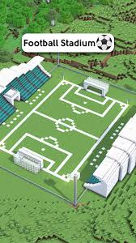
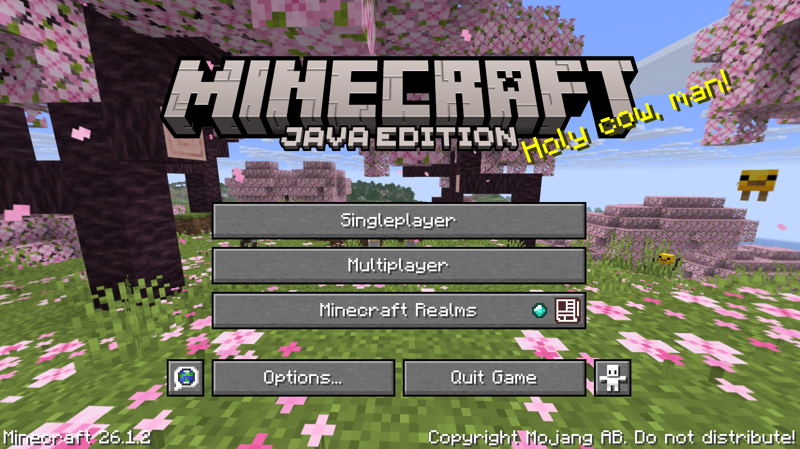

# CS105

## 0. Yêu cầu

### 1. Hoàn thiện kết cấu sân

- Bổ sung giàn đèn, bảng tỉ số (có thể tham khảo trên https://www.minecraftskins.com/) hoặc genAI như trong ()
- Xây lại các góc sân cho giống mẫu, xây lại đường hầm ra sân (tunnel) và phần khán đàn ở đó, xây lại phần đỉnh của khán đài theo dạng bậc thang.
- Optional: Xây tầng 2 và mái che cho các khán đài ()

### 2. Thực hiện chiếu phối cảnh, tăng giảm các toạ độ x,y,z near, far và các màn hình game:

- Cải thiện màn hình chờ vào game để chờ game load ổn, thêm logic chờ load xong game ở màn hình này:  và decorate + 1 tí 
- Cần thêm UI để chỉnh trực tiếp `near`, `far` của `PerspectiveCamera` trong lúc chạy để thấy rõ hiệu ứng frustum culling (đưa vào bên trong màn hình pause) - tận dụng bảng điều khiển hiện tại ở góc trên phải màn hình và phần settings của game.
- Thu gọn bảng điều khiển góc phải trên màn hình hiện tại -> tích hợp vào phần menu của game khi pause để tra cứu toàn bộ phím tắt

### 3. Áp dụng phép biến đổi Affine cơ sở trên các khối hình cơ bản này.
- Lưu ý: phải cho phép chọn các phép biến đổi và thực hiện thao tác bằng sự kiện chuột hoặc bàn phím hoặc tự động
- Thực hiện các phép biến đổi hình học cơ bản như: 
o	Tịnh tiến
o	Quay
o	Tỉ lệ

Hiện game chỉ có phép biến đổi ngầm thông qua di chuyển của Player/Camera. Chưa có chức năng (như `dat.GUI` hoặc phím tắt) để chủ động chọn 1 object và tinh chỉnh (Translate, Rotate, Scale)

**Đề xuất**: Thêm một vật thể 3D đặc biệt (VD: [chiếc Cúp vô địch](https://www.minecraftskins.com/skin/10794070/golden-chalice/)) vào sân và tích hợp `dat.GUI` để người dùng có thể tự do tịnh tiến, xoay, thay đổi tỉ lệ của vật thể này.

### 4. Chiếu sáng đối tượng
-	Chiếu sáng toàn phần (1)
-	Nguồn sáng (2)
-	Bóng đổ (3)
- Triển khai mô hình chiếu sáng đơn giản gồm ánh sáng môi trường, ánh sáng điểm và ánh sáng định hướng.
- Tạo hiệu ứng bóng đổ (kĩ thuật shadow mapping).

Đồ án dùng ánh sáng voxel cơ bản và custom Tessellator. Tuy `shadowMap` có bật trong `WebGLRenderer`, nhưng chưa khai thác các nguồn sáng thực tế (PointLight, DirectionalLight, SpotLight) có tính năng bóng đổ rọi lên vật thể.

**Đề xuất**: 
- Tùy chỉnh ánh sáng Mặt Trời/Mặt Trăng thành `DirectionalLight` thật để đổ bóng toàn cục (1)
- Thêm `PointLight` vào các khối đuốc (Torch) tạo ánh sáng điểm mang vibe Minecraft cổ điển.
- Lắp 4 đèn `SpotLight` ở 4 góc sân chiếu xuống trung tâm, có chiếu sáng kiểu nguồn sáng (2)
- Bật `castShadow` và `receiveShadow` cho cầu thủ, quả bóng và mặt cỏ.

### Texture:
-	Chọn mở 1 ảnh bitmap hoặc thiết kế sẵn các ảnh để người dùng có thể lựa chọn và thực hiện texture mapping trên đối tượng.
-	Hoặc có thể texture mapping sẵn trên các đối tượng.

**Đề xuất**: Nâng cấp chất lượng vật liệu bằng `MeshStandardMaterial` và thêm `bumpMap`/`roughnessMap` để sân cỏ và đồ vật (ghế khán đài, quả bóng, khung thành), vật liệu xây sân trông sần sùi và phản quang thật hơn.

### 5. Animation (bonus):

-	Các bạn tự sáng tạo các animation tuỳ ý.
-	Các đối tượng sẽ tự di chuyển và biến đổi theo animation mình định nghĩa.
-	Xây dựng mô phỏng chuyển động của một hoặc nhiều vật thể trong không gian 3D.

**Đánh giá**: Có animation cơ bản (bước đi, vung tay) và vật lý AABB. Chưa có vật lý thực tế như `cannon-es` cho các va chạm phức tạp.

**Đề xuất**: 
- **Va chạm (Collision):** Tích hợp `cannon-es` để quả bóng lăn, nảy lên khi sút, dội ra khi chạm cột gôn thay vì trượt cứng.
- **Animation:** 
   - Quả bóng tự lăn tròn (rotation) theo hướng di chuyển. 
   - Bắn hiệu ứng hạt (Confetti/Pháo hoa) 2 bên đường hầm khi cầu thủ đi ra.
   - Va chạm các nhân vật khác nhau, mặt các nhân vật npc đều nhìn về phía quả bóng

## 1. Cài Đặt Python

### Windows:
1. Truy cập: [https://www.python.org/downloads/](https://www.python.org/downloads/)
2. Tải phiên bản mới nhất cho Windows.
3. **Lưu ý:** Trong quá trình cài đặt, hãy tích vào ô `Add Python to PATH`.
4. Sau khi cài xong, mở `Command Prompt` và kiểm tra:
   ```sh
   python --version
   ```

### macOS:
Mở Terminal và gõ:
```sh
brew install python
```

### Linux (Debian/Ubuntu):
```sh
sudo apt update
sudo apt install python3
```

---

## 2. Chạy HTTP Server

Từ thư mục chứa file `index.html`, chạy lệnh:

```sh
python -m http.server 8000
```

Server sẽ khởi động tại địa chỉ:
```
http://localhost:8000/
```

---

## 3. Truy cập game

```
http://localhost:8000/index.html
```

---

## 🎮 Hướng Dẫn Điều Khiển (Game Controls)

Dưới đây là danh sách đầy đủ tất cả các phím điều khiển có sẵn trong game:

| Phím (Key) | Chức năng (Function) | Chi tiết (Details) |
| :--- | :--- | :--- |
| **`W` / `A` / `S` / `D`** | Di chuyển (Movement) | Tiến, Trái, Lùi, Phải |
| **`Space` (Dấu cách)** | Nhảy (Jump) | Nhảy lên |
| **`Double Space`** | Kích hoạt Bay (Toggle Flight) | Nhấp nhanh phím Space 2 lần liên tiếp để bay |
| **`Space` / `Shift`** | Bay lên / Bay xuống (Fly Up/Down) | Chỉ hoạt động khi đang ở chế độ Bay (Flight Mode) |
| **`Left Control` / `Double W`** | Chạy nhanh (Sprint) | Nhấn giữ `Ctrl` hoặc nhấp nhanh `W` 2 lần để tăng tốc chạy |
| **`F5`** | Đổi góc nhìn (Perspective) | Đổi giữa góc nhìn thứ nhất (1st Person) và góc nhìn thứ ba (3rd Person) |
| **`E`** | Mở kho đồ (Inventory) | Mở giao diện Creative Inventory để chọn blocks |
| **`T`** | Khung chat (Chat Menu) | Mở bảng gõ câu lệnh hoặc trò chuyện |
| **`Tab`** | Bảng danh sách người chơi (Player List) | Xem danh sách người chơi đang kết nối |
| **`Esc`** | Menu cài đặt (Pause Menu) | Dừng game và mở tùy chọn cài đặt |
