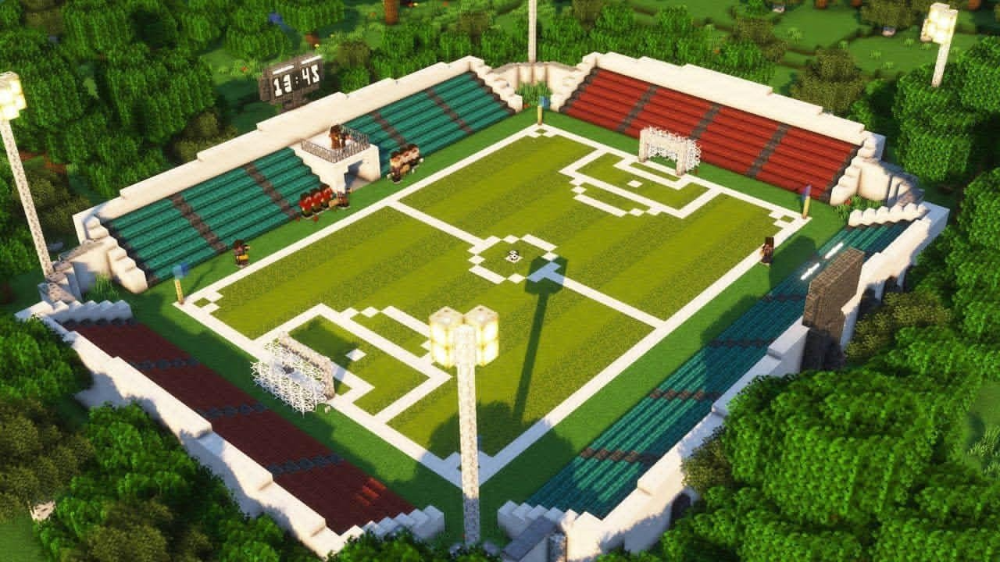
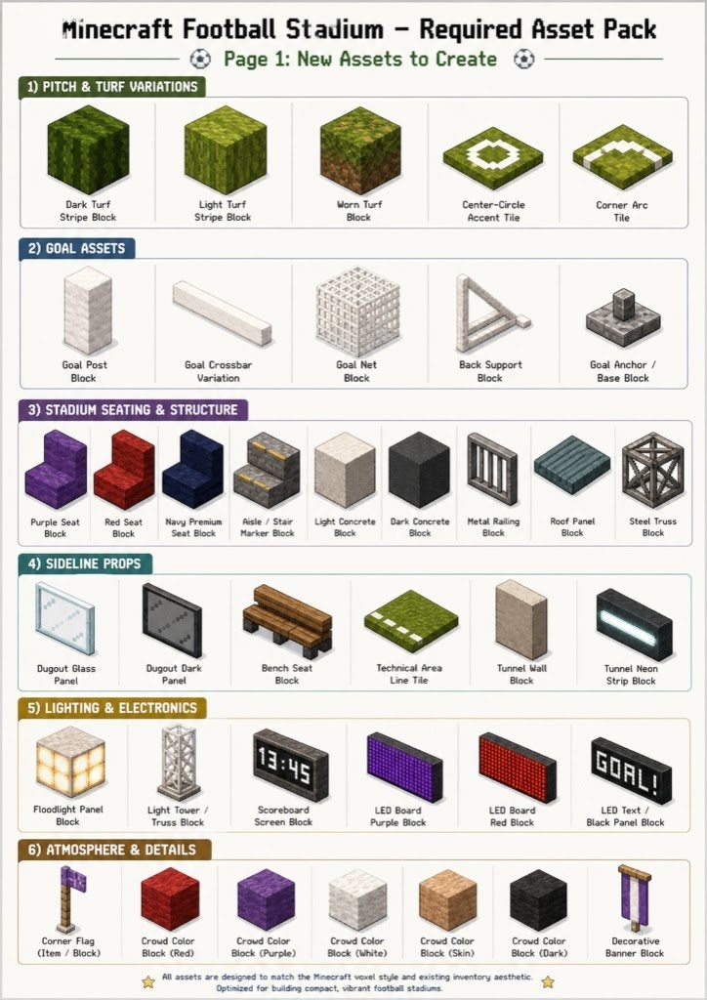

# UI/UX

## Overview

Ta đang làm asset cho một game **Minecraft-style football stadium** chạy trên nền JavaScript/Three.js Minecraft clone. Mục tiêu hiện tại không phải tạo inventory preview đẹp, mà là tạo **game texture dùng trực tiếp trong engine** để build sân bóng voxel: mặt cỏ, line sân, khung thành, khán đài, đèn, scoreboard, dugout, crowd và props. Vì engine render block bằng texture atlas / UV mapping, phần lớn asset phải là **flat pixel-art texture**, không phải ảnh isometric, không phải 3D render, không phải inventory icon.

**The model:**



**The asset list:**



## Asset checklist

### Batch 1 — Must-have để build sân nhanh

| Done | Asset                   | Type             | Size  | Note                   |
| ---- | ----------------------- | ---------------- | ----- | ---------------------- |
| [ ]  | Dark Turf Block         | top-down tile    | 16x16 | grass đậm, no stripe   |
| [ ]  | Light Turf Block        | top-down tile    | 16x16 | grass sáng, same style |
| [ ]  | White Pitch Line Tile   | top-down marking | 16x16 | line trắng             |
| [ ]  | Center Circle Tile      | top-down marking | 16x16 | arc trắng              |
| [ ]  | Corner Arc Tile         | top-down marking | 16x16 | quarter arc            |
| [ ]  | Goal Post Block         | block texture    | 16x16 | trắng                  |
| [ ]  | Goal Crossbar           | block texture    | 16x16 | trắng                  |
| [ ]  | Goal Net Texture        | transparent      | 32x32 | alpha thật             |
| [ ]  | Light Concrete Block    | block texture    | 16x16 | tường sáng             |
| [ ]  | Dark Concrete Block     | block texture    | 16x16 | tường tối              |
| [ ]  | Red Seat Block          | block texture    | 16x16 | ghế đỏ                 |
| [ ]  | Teal Seat Block         | block texture    | 16x16 | ghế teal               |
| [ ]  | Floodlight Panel Block  | front-facing     | 16x16 | đèn                    |
| [ ]  | Scoreboard Screen Block | front-facing     | 32x16 | bảng giờ               |
| [ ]  | Corner Flag Texture     | transparent      | 32x32 | pole + flag            |
| [ ]  | Soccer Ball Texture     | sphere texture   | 64x32 | equirectangular        |

### Batch 2 — Stadium detail

| Done | Asset                      | Type             | Size  | Note                     |
| ---- | -------------------------- | ---------------- | ----- | ------------------------ |
| [ ]  | Worn Turf Block            | top-down tile    | 16x16 | grass + dirt patch       |
| [ ]  | Back Support Block         | block texture    | 16x16 | goal support             |
| [ ]  | Goal Anchor / Base Block   | block texture    | 16x16 | grey base                |
| [ ]  | Purple Seat Block          | block texture    | 16x16 | ghế tím                  |
| [ ]  | Navy Premium Seat Block    | block texture    | 16x16 | ghế navy                 |
| [ ]  | Aisle / Stair Marker Block | block texture    | 16x16 | concrete + yellow stripe |
| [ ]  | Metal Railing Block        | transparent      | 32x32 | bars                     |
| [ ]  | Roof Panel Block           | block texture    | 16x16 | teal roof                |
| [ ]  | Steel Truss Block          | transparent      | 32x32 | diagonal braces          |
| [ ]  | Bench Seat Block           | block texture    | 16x16 | wood plank               |
| [ ]  | Technical Area Line Tile   | top-down marking | 16x16 | coaching box line        |
| [ ]  | LED Board Purple           | front-facing     | 32x16 | purple matrix            |
| [ ]  | LED Board Red              | front-facing     | 32x16 | red matrix               |

### Batch 3 — Polish

| Done | Asset                        | Type          | Size  | Note           |
| ---- | ---------------------------- | ------------- | ----- | -------------- |
| [ ]  | Dugout Glass Panel           | transparent   | 32x32 | glass          |
| [ ]  | Dugout Dark Panel            | transparent   | 32x32 | smoked glass   |
| [ ]  | Tunnel Wall Block            | block texture | 16x16 | tunnel wall    |
| [ ]  | Tunnel Neon Strip Block      | front-facing  | 16x16 | cyan strip     |
| [ ]  | LED Text / Black Panel Block | front-facing  | 32x16 | GOAL text      |
| [ ]  | Crowd Block Red              | block texture | 16x16 | abstract crowd |
| [ ]  | Crowd Block Purple           | block texture | 16x16 | abstract crowd |
| [ ]  | Crowd Block White            | block texture | 16x16 | abstract crowd |
| [ ]  | Crowd Block Skin             | block texture | 16x16 | abstract crowd |
| [ ]  | Crowd Block Dark             | block texture | 16x16 | abstract crowd |
| [ ]  | Decorative Banner Block      | transparent   | 32x32 | hanging banner |

---

# Minecraft Football Stadium — Asset Generation Checklist & Prompt Pack

## 0. Workflow context

Ta đang làm asset cho một game **Minecraft-style football stadium** chạy trên nền JavaScript/Three.js Minecraft clone. Mục tiêu hiện tại không phải tạo inventory preview đẹp, mà là tạo **game texture dùng trực tiếp trong engine** để build sân bóng voxel: mặt cỏ, line sân, khung thành, khán đài, đèn, scoreboard, dugout, crowd và props. Vì engine render block bằng texture atlas / UV mapping, phần lớn asset phải là **flat pixel-art texture**, không phải ảnh isometric, không phải 3D render, không phải inventory icon.

**Workflow đúng:**

```text
flat game texture → texture atlas / material map → voxel block / plane → stadium world
```

**Preview vs game texture:**

```text
isometric asset image = inventory / document preview only
game texture = actual in-world render asset
```

---

## 1. Prompting rules for Flow / Gemini / Nano Banana

Google/Gemini image prompting works better when the prompt is specific about **subject, style, output format, and constraints**. For this project, every prompt should tell the model exactly what kind of texture is needed, what view direction it should use, and what mistakes it must avoid.

### Global rule

```text
1 asset = 1 game texture
```

Do not ask for preview, isometric render, 3D inventory view, mockup sheet, or multiple outputs.

### Master base prompt

Use this at the start of each generation if the image model keeps creating previews:

```text
Create ONLY ONE engine-ready GAME TEXTURE for a Minecraft-style voxel football stadium.

Flat texture only.
No isometric view.
No 3D render.
No inventory icon.
No perspective.
No shadows.
No UI.
No labels.
No logos.
Minecraft-style pixel art.
Crisp pixel edges.
Output PNG.
```

---

## 2. Asset checklist

## Batch 1 — Must-have để build sân nhanh

| Done | Asset                   | Type             | Size  | Note                   |
| ---- | ----------------------- | ---------------- | ----- | ---------------------- |
| [ ]  | Dark Turf Block         | top-down tile    | 16x16 | grass đậm, no stripe   |
| [ ]  | Light Turf Block        | top-down tile    | 16x16 | grass sáng, same style |
| [ ]  | White Pitch Line Tile   | top-down marking | 16x16 | line trắng             |
| [ ]  | Center Circle Tile      | top-down marking | 16x16 | arc trắng              |
| [ ]  | Corner Arc Tile         | top-down marking | 16x16 | quarter arc            |
| [ ]  | Goal Post Block         | block texture    | 16x16 | trắng                  |
| [ ]  | Goal Crossbar           | block texture    | 16x16 | trắng                  |
| [ ]  | Goal Net Texture        | transparent      | 32x32 | alpha thật             |
| [ ]  | Light Concrete Block    | block texture    | 16x16 | tường sáng             |
| [ ]  | Dark Concrete Block     | block texture    | 16x16 | tường tối              |
| [ ]  | Red Seat Block          | block texture    | 16x16 | ghế đỏ                 |
| [ ]  | Teal Seat Block         | block texture    | 16x16 | ghế teal               |
| [ ]  | Floodlight Panel Block  | front-facing     | 16x16 | đèn                    |
| [ ]  | Scoreboard Screen Block | front-facing     | 32x16 | bảng giờ               |
| [ ]  | Corner Flag Texture     | transparent      | 32x32 | pole + flag            |
| [ ]  | Soccer Ball Texture     | sphere texture   | 64x32 | equirectangular        |

## Batch 2 — Stadium detail

| Done | Asset                      | Type             | Size  | Note                     |
| ---- | -------------------------- | ---------------- | ----- | ------------------------ |
| [ ]  | Worn Turf Block            | top-down tile    | 16x16 | grass + dirt patch       |
| [ ]  | Back Support Block         | block texture    | 16x16 | goal support             |
| [ ]  | Goal Anchor / Base Block   | block texture    | 16x16 | grey base                |
| [ ]  | Purple Seat Block          | block texture    | 16x16 | ghế tím                  |
| [ ]  | Navy Premium Seat Block    | block texture    | 16x16 | ghế navy                 |
| [ ]  | Aisle / Stair Marker Block | block texture    | 16x16 | concrete + yellow stripe |
| [ ]  | Metal Railing Block        | transparent      | 32x32 | bars                     |
| [ ]  | Roof Panel Block           | block texture    | 16x16 | teal roof                |
| [ ]  | Steel Truss Block          | transparent      | 32x32 | diagonal braces          |
| [ ]  | Bench Seat Block           | block texture    | 16x16 | wood plank               |
| [ ]  | Technical Area Line Tile   | top-down marking | 16x16 | coaching box line        |
| [ ]  | LED Board Purple           | front-facing     | 32x16 | purple matrix            |
| [ ]  | LED Board Red              | front-facing     | 32x16 | red matrix               |

## Batch 3 — Polish

| Done | Asset                        | Type          | Size  | Note           |
| ---- | ---------------------------- | ------------- | ----- | -------------- |
| [ ]  | Dugout Glass Panel           | transparent   | 32x32 | glass          |
| [ ]  | Dugout Dark Panel            | transparent   | 32x32 | smoked glass   |
| [ ]  | Tunnel Wall Block            | block texture | 16x16 | tunnel wall    |
| [ ]  | Tunnel Neon Strip Block      | front-facing  | 16x16 | cyan strip     |
| [ ]  | LED Text / Black Panel Block | front-facing  | 32x16 | GOAL text      |
| [ ]  | Crowd Block Red              | block texture | 16x16 | abstract crowd |
| [ ]  | Crowd Block Purple           | block texture | 16x16 | abstract crowd |
| [ ]  | Crowd Block White            | block texture | 16x16 | abstract crowd |
| [ ]  | Crowd Block Skin             | block texture | 16x16 | abstract crowd |
| [ ]  | Crowd Block Dark             | block texture | 16x16 | abstract crowd |
| [ ]  | Decorative Banner Block      | transparent   | 32x32 | hanging banner |

---

# 3. Prompt từng asset — notes đã gộp trực tiếp vào từng prompt


## 3. Master prompt

Dán phần này trước prompt từng asset nếu tool hay tạo sai kiểu.

```text
Create ONLY ONE engine-ready GAME TEXTURE for a Minecraft-style voxel football stadium.

Flat texture only.
No isometric view.
No 3D render.
No inventory icon.
No perspective.
No shadows.
No UI.
No labels.
No logos.

Minecraft-style pixel art.
Crisp pixel edges.
Output PNG.
```

---

# 4. Prompt từng asset

## 01. Dark Turf Block

```text
Create ONLY ONE engine-ready GAME TEXTURE for a Minecraft-style voxel football stadium.

Asset name: Dark Turf Block

Requirements:
- 16x16 PNG
- Flat top-down seamless grass texture
- Random natural pixel-art grass noise
- Slightly darker green football pitch tone
- Subtle variation using 3–4 green shades
- Tileable

Important turf workflow:
- DO NOT put mowing stripes inside this texture
- NO stripes
- NO black lines
- NO large bands
- NO obvious repeated pattern
- Only natural grass pixel noise
- Pitch mowing stripes will be created by alternating Dark Turf Block and Light Turf Block in the world layout/code

Style:
- Minecraft-style pixel art
- Crisp pixel edges
- No isometric, no 3D render, no perspective, no shadow, no UI, no labels, no logo
```

## 02. Light Turf Block

```text
Create ONLY ONE engine-ready GAME TEXTURE for a Minecraft-style voxel football stadium.

Asset name: Light Turf Block

Requirements:
- 16x16 PNG
- Flat top-down seamless grass texture
- Same noise density and style as Dark Turf Block
- Brighter green tone, about 10–15% lighter than Dark Turf Block
- Tileable

Important turf workflow:
- DO NOT put mowing stripes inside this texture
- NO stripes
- NO black lines
- NO large bands
- NO obvious repeated pattern
- Only brightness/tone should differ from Dark Turf Block
- Pitch mowing stripes will be created by alternating Dark Turf Block and Light Turf Block in the world layout/code

Style:
- Minecraft-style pixel art
- Crisp pixel edges
- No isometric, no 3D render, no perspective, no shadow, no UI, no labels, no logo
```

## 03. Worn Turf Block

```text
Create ONLY ONE engine-ready GAME TEXTURE for a Minecraft-style voxel football stadium.

Asset name: Worn Turf Block

Requirements:
- 16x16 PNG
- Flat top-down football turf texture
- Mostly green grass, with small worn patches
- Add subtle yellow-green dry grass and tiny brown dirt pixels
- Tileable enough for repeated use

Important turf workflow:
- Do not make it mostly dirt
- Do not add pitch markings
- Do not add mowing stripes
- NO black lines
- Worn turf is for damaged/use-heavy areas only, not for the main pitch stripe pattern

Style:
- Minecraft-style pixel art
- Crisp pixel edges
- No isometric, no 3D render, no perspective, no shadow, no UI, no labels, no logo
```

## 04. White Pitch Line Tile

```text
Create ONLY ONE engine-ready GAME TEXTURE for a Minecraft-style voxel football stadium.

Asset name: White Pitch Line Tile

Requirements:
- 16x16 PNG
- Flat top-down grass tile
- Same green grass base as the turf blocks
- One clean thick white football pitch line crossing the tile horizontally or vertically
- White line should be crisp and readable from distance

Important pitch-marking workflow:
- This is a dedicated line tile: grass base + white marking
- Do not create a full field marking layout in one image
- Do not add extra symbols or multiple unrelated lines
- This tile will be repeated in the world to build touchlines, box lines, and midfield lines

Style:
- Minecraft-style pixel art
- Crisp pixel edges
- No isometric, no 3D render, no perspective, no shadow, no UI, no labels, no logo
```

## 05. Center Circle Tile

```text
Create ONLY ONE engine-ready GAME TEXTURE for a Minecraft-style voxel football stadium.

Asset name: Center Circle Tile

Requirements:
- 16x16 PNG
- Flat top-down grass tile
- White curved arc segment, part of a football center circle
- Clean pixel-art curve
- Designed to combine with other tiles into a full center circle

Important pitch-marking workflow:
- This is one modular marking tile, not a full center circle image
- Do not draw a full circle in one tile
- Do not add text or symbols
- The full circle will be assembled from multiple Center Circle Tiles in the world layout

Style:
- Minecraft-style pixel art
- Crisp pixel edges
- No isometric, no 3D render, no perspective, no shadow, no UI, no labels, no logo
```

## 06. Corner Arc Tile

```text
Create ONLY ONE engine-ready GAME TEXTURE for a Minecraft-style voxel football stadium.

Asset name: Corner Arc Tile

Requirements:
- 16x16 PNG
- Flat top-down grass tile
- White quarter-circle football corner arc marking
- Clean pixelated white curve
- Suitable for pitch corner placement

Important pitch-marking workflow:
- This is a dedicated corner marking tile: grass base + white quarter arc
- Do not create a full corner area scene
- Do not add flag, shadow, or extra field details
- The corner arc will be placed on the pitch grid as a modular tile

Style:
- Minecraft-style pixel art
- Crisp pixel edges
- No isometric, no 3D render, no perspective, no shadow, no UI, no labels, no logo
```

## 07. Goal Post Block

```text
Create ONLY ONE engine-ready GAME TEXTURE for a Minecraft-style voxel football stadium.

Asset name: Goal Post Block

Requirements:
- 16x16 PNG
- Flat block-face texture
- Clean white painted metal material
- Slight light grey pixel shading
- Suitable for vertical goal posts

Important goal workflow:
- This is only the flat material texture for voxel goal-post blocks
- Do not render a full 3D goal
- Do not include net texture, base, grass, or shadows

Style:
- Minecraft-style pixel art
- Crisp pixel edges
- No isometric, no 3D render, no perspective, no shadow, no UI, no labels, no logo
```

## 08. Goal Crossbar

```text
Create ONLY ONE engine-ready GAME TEXTURE for a Minecraft-style voxel football stadium.

Asset name: Goal Crossbar

Requirements:
- 16x16 PNG
- Flat block-face texture
- Clean white painted metal material
- Should match Goal Post Block
- Subtle horizontal highlight pixels to suggest a crossbar surface

Important goal workflow:
- This is only the flat material texture for voxel crossbar blocks
- Do not render a full 3D goal
- Do not include net texture, base, grass, or shadows

Style:
- Minecraft-style pixel art
- Crisp pixel edges
- No isometric, no 3D render, no perspective, no shadow, no UI, no labels, no logo
```

## 09. Goal Net Texture

```text
Create ONLY ONE engine-ready GAME TEXTURE for a Minecraft-style voxel football stadium.

Asset name: Goal Net Texture

Requirements:
- 32x32 PNG
- TRUE transparent background with alpha channel
- White football goal net pattern
- Thin 1px white lines
- Square or slightly diamond net mesh
- Spacing between lines around 5–6 pixels
- Empty spaces must be transparent

Important transparency workflow:
- Do NOT draw checkerboard background
- Do NOT draw grey background
- Do NOT make a solid panel
- Do NOT use thick white bars
- Empty spaces must be actual alpha transparency, not grey pixels
- This texture will be used on transparent planes/panels for the goal net
- Best alternative: create this manually by code or pixel tool if AI fails transparency

Style:
- Minecraft-style pixel art
- Crisp pixel edges
- No isometric, no 3D render, no perspective, no shadow, no UI, no labels, no logo
```

## 10. Back Support Block

```text
Create ONLY ONE engine-ready GAME TEXTURE for a Minecraft-style voxel football stadium.

Asset name: Back Support Block

Requirements:
- 16x16 PNG
- Flat block-face texture
- White or pale grey structural metal
- Should match goal post and crossbar materials
- Optional subtle diagonal support-like pixels

Important goal workflow:
- This is a flat material texture for goal support blocks
- Do not render the triangular frame as an isometric object
- Do not include net, grass, base, or shadows

Style:
- Minecraft-style pixel art
- Crisp pixel edges
- No isometric, no 3D render, no perspective, no shadow, no UI, no labels, no logo
```

## 11. Goal Anchor / Base Block

```text
Create ONLY ONE engine-ready GAME TEXTURE for a Minecraft-style voxel football stadium.

Asset name: Goal Anchor / Base Block

Requirements:
- 16x16 PNG
- Flat block texture
- Grey concrete or metal base
- Darker center plate or bolt-like pixels
- Suitable for goal base/anchor placement

Important goal workflow:
- This is a block texture, not an isometric base preview
- Do not include full goal frame, grass platform, shadow, or perspective view

Style:
- Minecraft-style pixel art
- Crisp pixel edges
- No isometric, no 3D render, no perspective, no shadow, no UI, no labels, no logo
```

## 12. Purple Seat Block

```text
Create ONLY ONE engine-ready GAME TEXTURE for a Minecraft-style voxel football stadium.

Asset name: Purple Seat Block

Requirements:
- 16x16 PNG
- Flat block texture
- Purple plastic stadium seat material
- Dark purple base with lighter purple highlights
- Tileable across large stand sections

Important seating workflow:
- This is only the material texture for voxel/stair-like seat blocks
- Do not render an isometric chair or stair block
- Do not include background, shadow, or full stand scene

Style:
- Minecraft-style pixel art
- Crisp pixel edges
- No isometric, no 3D render, no perspective, no shadow, no UI, no labels, no logo
```

## 13. Red Seat Block

```text
Create ONLY ONE engine-ready GAME TEXTURE for a Minecraft-style voxel football stadium.

Asset name: Red Seat Block

Requirements:
- 16x16 PNG
- Flat block texture
- Red plastic stadium seat material
- Deep red base with dark red shadows and bright red highlights
- Tileable across large stand sections

Important seating workflow:
- This is only the material texture for voxel/stair-like seat blocks
- Do not render an isometric chair or stair block
- Do not include background, shadow, or full stand scene

Style:
- Minecraft-style pixel art
- Crisp pixel edges
- No isometric, no 3D render, no perspective, no shadow, no UI, no labels, no logo
```

## 14. Navy Premium Seat Block

```text
Create ONLY ONE engine-ready GAME TEXTURE for a Minecraft-style voxel football stadium.

Asset name: Navy Premium Seat Block

Requirements:
- 16x16 PNG
- Flat block texture
- Dark navy blue stadium seat material
- Subtle highlights and darker shadow pixels
- Slightly premium/darker look compared to normal seats
- Tileable

Important seating workflow:
- This is only the material texture for voxel/stair-like seat blocks
- Do not render an isometric chair or stair block
- Do not include background, shadow, or full stand scene

Style:
- Minecraft-style pixel art
- Crisp pixel edges
- No isometric, no 3D render, no perspective, no shadow, no UI, no labels, no logo
```

## 15. Teal Seat Block

```text
Create ONLY ONE engine-ready GAME TEXTURE for a Minecraft-style voxel football stadium.

Asset name: Teal Seat Block

Requirements:
- 16x16 PNG
- Flat block texture
- Teal/turquoise plastic stadium seat material
- Base color around teal blue-green
- Darker teal shadows and lighter cyan-green highlights
- Tileable across large stand sections

Important seating workflow:
- This is only the material texture for voxel/stair-like seat blocks
- Do not render an isometric chair or stair block
- Do not include background, shadow, or full stand scene

Style:
- Minecraft-style pixel art
- Crisp pixel edges
- No isometric, no 3D render, no perspective, no shadow, no UI, no labels, no logo
```

## 16. Aisle / Stair Marker Block

```text
Create ONLY ONE engine-ready GAME TEXTURE for a Minecraft-style voxel football stadium.

Asset name: Aisle / Stair Marker Block

Requirements:
- 16x16 PNG
- Flat block texture
- Dark concrete or grey stair material
- Yellow safety stripe or edge marker pixels
- Suitable for stadium aisle/stair blocks

Important structure workflow:
- This is a flat material texture for stair/aisle blocks
- Do not render a full staircase object
- Do not include perspective, shadow, or surrounding seats

Style:
- Minecraft-style pixel art
- Crisp pixel edges
- No isometric, no 3D render, no perspective, no shadow, no UI, no labels, no logo
```

## 17. Light Concrete Block

```text
Create ONLY ONE engine-ready GAME TEXTURE for a Minecraft-style voxel football stadium.

Asset name: Light Concrete Block

Requirements:
- 16x16 PNG
- Flat block texture
- Light concrete / off-white stadium wall material
- Subtle rough pixel noise
- Small crack or surface variation allowed
- Seamless/tileable

Important structure workflow:
- This is a general stadium wall/stair material
- Do not render a cube preview
- Do not include lighting shadows, bevels, or perspective

Style:
- Minecraft-style pixel art
- Crisp pixel edges
- No isometric, no 3D render, no perspective, no shadow, no UI, no labels, no logo
```

## 18. Dark Concrete Block

```text
Create ONLY ONE engine-ready GAME TEXTURE for a Minecraft-style voxel football stadium.

Asset name: Dark Concrete Block

Requirements:
- 16x16 PNG
- Flat block texture
- Dark charcoal concrete material
- Subtle rough pixel noise
- Seamless/tileable

Important structure workflow:
- This is a general stadium wall/stair/support material
- Do not render a cube preview
- Do not include lighting shadows, bevels, or perspective

Style:
- Minecraft-style pixel art
- Crisp pixel edges
- No isometric, no 3D render, no perspective, no shadow, no UI, no labels, no logo
```

## 19. Metal Railing Block

```text
Create ONLY ONE engine-ready GAME TEXTURE for a Minecraft-style voxel football stadium.

Asset name: Metal Railing Block

Requirements:
- 32x32 PNG
- TRUE transparent background with alpha channel
- Front-facing metal railing texture
- Silver/grey vertical bars
- Top and bottom horizontal rail
- Empty gaps between bars must be transparent

Important transparency workflow:
- Do NOT draw checkerboard background
- Do NOT draw solid grey panel behind bars
- Empty gaps must be actual alpha transparency
- This texture will be used on a transparent block/plane, not as a solid wall texture

Style:
- Minecraft-style pixel art
- Crisp pixel edges
- No isometric, no 3D render, no perspective, no shadow, no UI, no labels, no logo
```

## 20. Roof Panel Block

```text
Create ONLY ONE engine-ready GAME TEXTURE for a Minecraft-style voxel football stadium.

Asset name: Roof Panel Block

Requirements:
- 16x16 PNG
- Flat block texture
- Teal or blue-grey stadium roof panel
- Simple panel/slat lines
- Seamless/tileable for roofing

Important structure workflow:
- This is a flat roof material texture, not a roof model
- Do not include perspective, shadows, or isometric panel render

Style:
- Minecraft-style pixel art
- Crisp pixel edges
- No isometric, no 3D render, no perspective, no shadow, no UI, no labels, no logo
```

## 21. Steel Truss Block

```text
Create ONLY ONE engine-ready GAME TEXTURE for a Minecraft-style voxel football stadium.

Asset name: Steel Truss Block

Requirements:
- 32x32 PNG
- TRUE transparent background with alpha channel
- Front-facing steel truss texture
- Grey metallic frame
- Diagonal cross braces
- Empty spaces must be transparent

Important transparency workflow:
- Do NOT draw checkerboard background
- Do NOT draw solid panel behind the structure
- Empty spaces must be actual alpha transparency
- This texture will be used on a transparent block/plane or repeated structural element

Style:
- Minecraft-style pixel art
- Crisp pixel edges
- No isometric, no 3D render, no perspective, no shadow, no UI, no labels, no logo
```

## 22. Dugout Glass Panel

```text
Create ONLY ONE engine-ready GAME TEXTURE for a Minecraft-style voxel football stadium.

Asset name: Dugout Glass Panel

Requirements:
- 32x32 PNG
- TRUE transparent background with alpha channel
- Front-facing transparent glass panel texture
- Pale blue or light grey edge highlights
- Mostly transparent center
- Subtle diagonal glass shine pixels

Important transparency workflow:
- Do NOT draw checkerboard background
- Do NOT make it opaque
- Transparent area must be actual alpha transparency
- This texture is for a flat transparent dugout panel, not an isometric glass object

Style:
- Minecraft-style pixel art
- Crisp pixel edges
- No isometric, no 3D render, no perspective, no shadow, no UI, no labels, no logo
```

## 23. Dugout Dark Panel

```text
Create ONLY ONE engine-ready GAME TEXTURE for a Minecraft-style voxel football stadium.

Asset name: Dugout Dark Panel

Requirements:
- 32x32 PNG
- Transparent or semi-transparent smoked glass/panel texture
- Dark grey edge frame
- Subtle highlights
- Suitable for dugout side/back panels

Important transparency workflow:
- Do NOT draw checkerboard background
- Do NOT make a fully solid wall unless specified
- Transparent/semi-transparent parts must use alpha channel
- This is a flat front-facing panel texture, not an isometric object

Style:
- Minecraft-style pixel art
- Crisp pixel edges
- No isometric, no 3D render, no perspective, no shadow, no UI, no labels, no logo
```

## 24. Bench Seat Block

```text
Create ONLY ONE engine-ready GAME TEXTURE for a Minecraft-style voxel football stadium.

Asset name: Bench Seat Block

Requirements:
- 16x16 PNG
- Flat block texture
- Wooden bench material
- Warm brown planks
- Simple horizontal plank lines
- Pixel-art wood variation

Important sideline workflow:
- This is only the material texture for bench blocks
- Do not render a full 3D bench
- Do not include legs, perspective, background, or shadow

Style:
- Minecraft-style pixel art
- Crisp pixel edges
- No isometric, no 3D render, no perspective, no shadow, no UI, no labels, no logo
```

## 25. Technical Area Line Tile

```text
Create ONLY ONE engine-ready GAME TEXTURE for a Minecraft-style voxel football stadium.

Asset name: Technical Area Line Tile

Requirements:
- 16x16 PNG
- Flat top-down grass tile
- White technical-area/coaching-box line marking
- Straight or corner line
- Crisp white pixel marking

Important pitch-marking workflow:
- This is a dedicated marking tile: grass base + white marking
- Do not draw the whole technical area in one image
- Do not add bench, dugout, people, or shadows
- The full coaching box will be assembled from repeated line tiles in the world layout

Style:
- Minecraft-style pixel art
- Crisp pixel edges
- No isometric, no 3D render, no perspective, no shadow, no UI, no labels, no logo
```

## 26. Tunnel Wall Block

```text
Create ONLY ONE engine-ready GAME TEXTURE for a Minecraft-style voxel football stadium.

Asset name: Tunnel Wall Block

Requirements:
- 16x16 PNG
- Flat block texture
- Light beige or pale concrete tunnel wall
- Subtle vertical construction pixels
- Slight roughness
- Seamless/tileable

Important structure workflow:
- This is a material texture for tunnel wall blocks
- Do not render a corridor scene
- Do not include perspective, lighting, people, or shadows

Style:
- Minecraft-style pixel art
- Crisp pixel edges
- No isometric, no 3D render, no perspective, no shadow, no UI, no labels, no logo
```

## 27. Tunnel Neon Strip Block

```text
Create ONLY ONE engine-ready GAME TEXTURE for a Minecraft-style voxel football stadium.

Asset name: Tunnel Neon Strip Block

Requirements:
- 16x16 PNG or 32x16 PNG
- Flat front-facing dark panel texture
- Black/dark casing
- One bright cyan horizontal neon strip
- Pixel-art glow style, no blur-heavy realistic bloom

Important LED/neon workflow:
- Use crisp pixel light, not realistic bloom
- Do not create a 3D neon object
- Do not add text, brand, or scene lighting
- Texture should remain readable when mapped onto a block face

Style:
- Minecraft-style pixel art
- Crisp pixel edges
- No isometric, no 3D render, no perspective, no shadow, no UI, no labels, no logo
```

## 28. Floodlight Panel Block

```text
Create ONLY ONE engine-ready GAME TEXTURE for a Minecraft-style voxel football stadium.

Asset name: Floodlight Panel Block

Requirements:
- 16x16 PNG
- Flat front-facing floodlight panel texture
- Warm white/yellow light cells arranged in a simple grid
- Pale metal or light concrete frame
- Emissive-looking pixel art but no realistic bloom

Important lighting workflow:
- This is a front-facing block texture, not a 3D floodlight render
- Use crisp light squares/pixels
- Do not add realistic lens flare, blur glow, shadows, or perspective
- The actual light effect should be handled later by engine lighting if needed

Style:
- Minecraft-style pixel art
- Crisp pixel edges
- No isometric, no 3D render, no perspective, no shadow, no UI, no labels, no logo
```

## 29. Light Tower / Truss Block

```text
Create ONLY ONE engine-ready GAME TEXTURE for a Minecraft-style voxel football stadium.

Asset name: Light Tower / Truss Block

Requirements:
- 32x32 PNG
- TRUE transparent background with alpha channel
- Front-facing metal tower truss texture
- Grey vertical tower frame
- Diagonal braces
- Empty spaces must be transparent
- Designed to stack vertically into a stadium light tower

Important transparency workflow:
- Do NOT draw checkerboard background
- Do NOT draw solid background panel
- Empty spaces must be actual alpha transparency
- This is a flat texture for repeated truss sections, not a full light tower model

Style:
- Minecraft-style pixel art
- Crisp pixel edges
- No isometric, no 3D render, no perspective, no shadow, no UI, no labels, no logo
```

## 30. Scoreboard Screen Block

```text
Create ONLY ONE engine-ready GAME TEXTURE for a Minecraft-style voxel football stadium.

Asset name: Scoreboard Screen Block

Requirements:
- 32x16 PNG preferred
- Flat front-facing scoreboard screen texture
- Dark casing/background
- Bright white pixel digits, for example "13:45"
- Simple electronic stadium scoreboard look

Important LED/scoreboard workflow:
- Use crisp pixel digits, not realistic LCD glow
- Do not add brand, club logo, sponsor, UI frame, or perspective
- Do not create a 3D scoreboard object
- Keep the screen readable when mapped onto a block face

Style:
- Minecraft-style pixel art
- Crisp pixel edges
- No isometric, no 3D render, no perspective, no shadow, no labels, no logo
```

## 31. LED Board Purple

```text
Create ONLY ONE engine-ready GAME TEXTURE for a Minecraft-style voxel football stadium.

Asset name: LED Board Purple

Requirements:
- 32x16 PNG preferred
- Flat front-facing LED board texture
- Dark panel background
- Purple LED dot-matrix pattern
- Tileable along pitch-side advertising boards

Important LED workflow:
- Use crisp pixel-art LED dots
- Do not use realistic glow blur
- No readable sponsor text
- No logo
- No 3D board render or perspective

Style:
- Minecraft-style pixel art
- Crisp pixel edges
- No isometric, no 3D render, no perspective, no shadow, no UI, no labels
```

## 32. LED Board Red

```text
Create ONLY ONE engine-ready GAME TEXTURE for a Minecraft-style voxel football stadium.

Asset name: LED Board Red

Requirements:
- 32x16 PNG preferred
- Flat front-facing LED board texture
- Dark panel background
- Red LED dot-matrix pattern
- Tileable along pitch-side advertising boards

Important LED workflow:
- Use crisp pixel-art LED dots
- Do not use realistic glow blur
- No readable sponsor text
- No logo
- No 3D board render or perspective

Style:
- Minecraft-style pixel art
- Crisp pixel edges
- No isometric, no 3D render, no perspective, no shadow, no UI, no labels
```

## 33. LED Text / Black Panel Block

```text
Create ONLY ONE engine-ready GAME TEXTURE for a Minecraft-style voxel football stadium.

Asset name: LED Text / Black Panel Block

Requirements:
- 32x16 PNG
- Flat front-facing black LED text panel
- Dark casing/background
- White pixel text reading "GOAL!"
- Chunky readable scoreboard-style letters

Important LED workflow:
- Use crisp pixel letters, not blurred glow
- No brand
- No sponsor
- No club logo
- No full 3D scoreboard object
- Keep it as a flat panel texture only

Style:
- Minecraft-style pixel art
- Crisp pixel edges
- No isometric, no 3D render, no perspective, no shadow, no extra UI
```

## 34. Corner Flag Texture

```text
Create ONLY ONE engine-ready GAME TEXTURE for a Minecraft-style voxel football stadium.

Asset name: Corner Flag Texture

Requirements:
- 32x32 PNG
- TRUE transparent background with alpha channel
- Flat front-facing corner flag prop texture
- Thin wooden or pale pole
- Small purple or blue flag near the top
- Empty background must be transparent

Important transparency workflow:
- Do NOT draw checkerboard background
- Empty background must be actual alpha transparency
- This is a flat texture for a prop/plane, not an isometric preview
- Do not include grass base, shadow, 3D block platform, or perspective view

Style:
- Minecraft-style pixel art
- Crisp pixel edges
- No isometric, no 3D render, no perspective, no shadow, no UI, no labels, no logo
```

## 35. Crowd Block Red

```text
Create ONLY ONE engine-ready GAME TEXTURE for a Minecraft-style voxel football stadium.

Asset name: Crowd Block Red

Requirements:
- 16x16 PNG
- Flat block texture
- Abstract red crowd/fan section material
- Use red clothing-like pixels with darker and lighter variation
- Should look like dense crowd color when repeated, not a detailed person
- Tileable

Important crowd workflow:
- This is an abstract crowd-color block, not an individual spectator sprite
- Do not draw faces, bodies, arms, or detailed people
- The crowd effect will come from many repeated color blocks in the stands

Style:
- Minecraft-style pixel art
- Crisp pixel edges
- No isometric, no 3D render, no perspective, no shadow, no UI, no labels, no logo
```

## 36. Crowd Block Purple

```text
Create ONLY ONE engine-ready GAME TEXTURE for a Minecraft-style voxel football stadium.

Asset name: Crowd Block Purple

Requirements:
- 16x16 PNG
- Flat block texture
- Abstract purple crowd/fan section material
- Use purple clothing-like pixels with darker and lighter variation
- Should look like dense crowd color when repeated, not a detailed person
- Tileable

Important crowd workflow:
- This is an abstract crowd-color block, not an individual spectator sprite
- Do not draw faces, bodies, arms, or detailed people
- The crowd effect will come from many repeated color blocks in the stands

Style:
- Minecraft-style pixel art
- Crisp pixel edges
- No isometric, no 3D render, no perspective, no shadow, no UI, no labels, no logo
```

## 37. Crowd Block White

```text
Create ONLY ONE engine-ready GAME TEXTURE for a Minecraft-style voxel football stadium.

Asset name: Crowd Block White

Requirements:
- 16x16 PNG
- Flat block texture
- Abstract white crowd/fan section material
- Use off-white, light grey, and small highlight pixels
- Should look like dense crowd color when repeated, not a detailed person
- Tileable

Important crowd workflow:
- This is an abstract crowd-color block, not an individual spectator sprite
- Do not draw faces, bodies, arms, or detailed people
- The crowd effect will come from many repeated color blocks in the stands

Style:
- Minecraft-style pixel art
- Crisp pixel edges
- No isometric, no 3D render, no perspective, no shadow, no UI, no labels, no logo
```

## 38. Crowd Block Skin

```text
Create ONLY ONE engine-ready GAME TEXTURE for a Minecraft-style voxel football stadium.

Asset name: Crowd Block Skin

Requirements:
- 16x16 PNG
- Flat block texture
- Abstract spectator/crowd block using mixed skin-tone pixels
- Use tan, beige, brown, and shadow variation
- Should suggest a crowd from distance, not detailed faces
- Tileable

Important crowd workflow:
- This is an abstract crowd-color block, not an individual spectator sprite
- Do not draw faces, bodies, arms, or detailed people
- The crowd effect will come from many repeated color blocks in the stands

Style:
- Minecraft-style pixel art
- Crisp pixel edges
- No isometric, no 3D render, no perspective, no shadow, no UI, no labels, no logo
```

## 39. Crowd Block Dark

```text
Create ONLY ONE engine-ready GAME TEXTURE for a Minecraft-style voxel football stadium.

Asset name: Crowd Block Dark

Requirements:
- 16x16 PNG
- Flat block texture
- Abstract dark crowd/fan section material
- Use black, charcoal, dark brown, and dark grey pixel variation
- Should look like dense shadowed crowd when repeated
- Tileable

Important crowd workflow:
- This is an abstract crowd-color block, not an individual spectator sprite
- Do not draw faces, bodies, arms, or detailed people
- The crowd effect will come from many repeated color blocks in the stands

Style:
- Minecraft-style pixel art
- Crisp pixel edges
- No isometric, no 3D render, no perspective, no shadow, no UI, no labels, no logo
```

## 40. Decorative Banner Block

```text
Create ONLY ONE engine-ready GAME TEXTURE for a Minecraft-style voxel football stadium.

Asset name: Decorative Banner Block

Requirements:
- 32x32 PNG
- TRUE transparent background with alpha channel
- Flat front-facing vertical hanging banner texture
- Purple cloth banner with simple trim
- Small wooden or metal top bar
- Empty background must be transparent

Important transparency workflow:
- Do NOT draw checkerboard background
- Empty background must be actual alpha transparency
- No logo or symbol
- This is a flat banner texture, not an isometric hanging object preview

Style:
- Minecraft-style pixel art
- Crisp pixel edges
- No isometric, no 3D render, no perspective, no shadow, no UI, no labels
```

## 41. Soccer Ball Texture

```text
Create ONLY ONE engine-ready GAME TEXTURE for a Minecraft-style voxel football stadium.

Asset name: Soccer Ball Texture

Requirements:
- 64x32 PNG
- Equirectangular texture for a Three.js SphereGeometry soccer ball
- Minecraft-style pixel-art black and white football pattern
- Black pentagon/hexagon-like patches distributed across the texture
- Readable when wrapped onto a small sphere

Important ball workflow:
- Texture only
- No 3D ball render
- No isometric preview
- No logo
- No realistic photo shading
- The texture will be wrapped onto a sphere in Three.js, so avoid perspective lighting baked into the image

Style:
- Minecraft-style pixel art
- Crisp pixel edges
- No perspective, no shadow, no UI, no labels
```

---

# 4. Edit prompts khi AI tạo sai

## Nếu AI tạo isometric / preview

```text
Regenerate as a flat engine-ready texture only. Remove all isometric view, 3D render, shadows, perspective, inventory-style presentation, and background. Make it a direct 16x16 / 32x32 / 32x16 game texture PNG.
```

## Nếu transparent bị checkerboard giả

```text
Remove the checkerboard. Use TRUE transparent background with alpha channel. Only keep the visible object pixels. Empty spaces must be transparent.
```

## Nếu turf bị sọc đen / pattern sân sai

```text
Remove all stripes, lines, and bands. This should be natural grass pixel noise only. Pitch stripes will be created by alternating dark and light turf blocks in the game layout.
```

## Nếu LED bị quá realistic / blur

```text
Remove realistic glow and blur. Use crisp pixel-art LED dots on a dark panel. Keep it readable and Minecraft-style.
```

## Nếu line sân bị mỏng quá

```text
Make the white pitch marking thicker and more readable from a distance. Keep the line pixelated and crisp.
```

---


